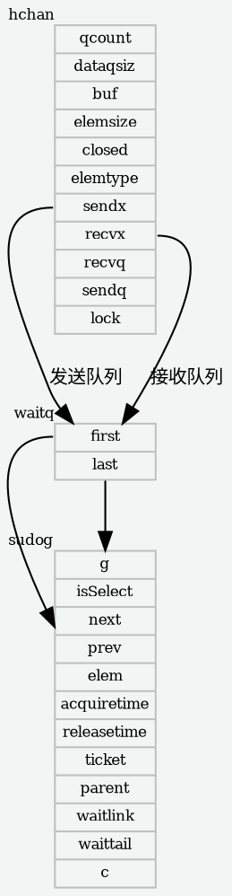

> 年初的时候go语言的学习提上了日程，前一篇sync.pool阅读之后，阅读代码进度本该更快些，奈何身体被掏空，所以这篇文章断断续续一个月终于攒起来了。

# 1. 简介

channel是golang中用于goroutine之间通讯的数据结构，有以下特点：

1. 线程安全
2. 创建channel时返回的是指针，不需要考虑拷贝的问题
3. 顺序通讯，写入和读出的顺序一致

# 2. 数据部分


**源码位置go/src/runtime/chan.go**

## 2.1  hchan

channel对应的数据结构

```go
type hchan struct {
	qcount   uint
	dataqsiz uint
	buf      unsafe.Pointer
	elemsize uint16
	closed   uint32
	elemtype *_type
	sendx    uint
	recvx    uint
	recvq    waitq
	sendq    waitq

	// lock protects all fields in hchan, as well as several
	// fields in sudogs blocked on this channel.
	//
	// Do not change another G's status while holding this lock
	// (in particular, do not ready a G), as this can deadlock
	// with stack shrinking.
	lock mutex
}
```

### 2.1.1 参数意义

qcount   uint // 表示channel中元素的个数
dataqsiz uint // 表示channel的大小长度
buf      unsafe.Pointer // 存储元素的环形队列头指针
elemsize uint16 // 表示此channel能存储元素的大小
closed   uint32 // channel是否关闭了
elemtype *_type // 表示此channel能存储元素的类型
sendx    uint // 表示发送操作对应buf的下标，超过dataqsiz之后清0（因为是循环队列嘛）
recvx    uint // 表示接收操作对应buf的下标
recvq    waitq // 等待接收操作的goroutine队列
sendq    waitq // 等待发送操作的goroutine队列

lock mutex // channel的锁

## 2.2 waitq

用来表示等待发送或者接受的goroutine队列（用sudog表示队列一个节点）

```go
type waitq struct {
	first *sudog
	last  *sudog
}
```

### 2.2.1 参数意义

```go
first goroutine指针，队首指针
last  goroutine指针，队尾指针
```

### 2.2.2 函数

#### 2.2.2.1 enqueue

两种情况：

1. 队列为空，将元素放入队尾将first指针和last指针赋好值
2. 队列不为空，直接将元素放入队尾

```go
func (q *waitq) enqueue(sgp *sudog) {
	// 将goroutine的next置为空
	sgp.next = nil
	x := q.last
	if x == nil { // 如果尾指针为空，说明队列为空，就把这个goroutine放进去
		sgp.prev = nil
		q.first = sgp
		q.last = sgp
		return
	}
	// 直接入队列
	sgp.prev = x
	x.next = sgp
	q.last = sgp
}
```

#### 2.2.2.2 dequeue

从队列头开始遍历

1. first指针为空，说明队列为空，则直接返回空
2. 如果队列只有一个元素了，将元素取出，并且清空first指针和last指针
3. 队列还有很多元素，直接将first指针对应的元素去除
4. 最后判断如果这个元素(sudog——在channel中用来表示等待接收或者发送的goroutine的)在select结构中并且select结构有其他接口，就跳过，继续遍历下一个节点。

```go
func (q *waitq) dequeue() *sudog {
	for {
		sgp := q.first
		if sgp == nil { // 头指针为空，说明队列为空，直接返回
			return nil
		}
		y := sgp.next
		if y == nil { // 如果next指针为空，说明队列就一个元素了，取出这个就空了，就将队列置空
			q.first = nil
			q.last = nil
		} else { // next不为空，就将next作为队首，将原来的队首返回
			y.prev = nil
			q.first = y
			sgp.next = nil // mark as removed (see dequeueSudog)
		}

		// if a gogoroutine was put on this queue because of a
		// select, there is a small window between the gogoroutine
		// being woken up by a different case and it grabbing the
		// channel locks. Once it has the lock
		// it removes itself from the queue, so we won't see it after that.
		// We use a flag in the G struct to tell us when someone
		// else has won the race to signal this gogoroutine but the gogoroutine
		// hasn't removed itself from the queue yet.
		// 如果goroutine处于select结构中并且select有其他出口就跳过这个
		if sgp.isSelect && !atomic.Cas(&sgp.g.selectDone, 0, 1) {
			continue
		}

		return sgp
	}
}
```

## 2.3 sudog

sudog是在等待对channel发送或者接受的goroutine

**为什么有了goroutine还要有一个sudog？**

1. 因为goroutine和等待的channel是多对多的关系，一个goroutine可能在等待多个channel，一个channel也可能有很多goroutine在等待，所以用sudog表示这个等待中的goroutine
2. sudog是channel等待或者接发送链表的一个node

**sudog通过acquireSudog创建，releaseSudog销毁**

1. 在go/src/runtime/proc.go中
2. go会维护一个全局的缓存（有锁），然后每个调度器（P）有自己的缓存
3. 创建sudog时会先从P的缓存中找，没有就到全局缓存中找，在没有才new一个
4. 销毁sudog的时候先判断P是不是满了，如果满了就将一半缓存放到全局缓存然后再把sudog放到自己缓存
5. 全局缓存的生存周期时两次GC的间隔，go/src/runtime/mgc.go 中clearpools()函数中可以看到，每次GC都会清理全局缓存

```go
type sudog struct {
	// sudog替哪个goroutine在等待
	g *g

	isSelect bool  // 是否在select结构中(select可能取消阻塞发送或接收)
	next     *sudog // 下一个节点
	prev     *sudog // 上一个节点
	elem     unsafe.Pointer // data element (may point to stack)

	acquiretime int64 // 创建时间
	releasetime int64 // 释放时间
	ticket      uint32
	parent      *sudog // semaRoot binary tree
	waitlink    *sudog // g.waiting list or semaRoot
	waittail    *sudog // semaRoot
	c           *hchan // channel 在等待哪个channel
}
```

### 2.3.1 创建sudog——acquireSudog

大概逻辑就是现在当前goroutine所在调度器(P)的缓存中找，如果没有就从全局缓存中找，如果还没有就new一个

```go
func acquireSudog() *sudog {
	// 获得当前goroutine所在的线程(M)
	mp := acquirem()
	// 获得当前goroutine所在调度器(P)
	pp := mp.p.ptr()
	if len(pp.sudogcache) == 0 { // 如果调度器的sudog缓存为空，就从中央缓存找，如果再为空就new一个
		lock(&sched.sudoglock)
		// First, try to grab a batch from central cache.
		for len(pp.sudogcache) < cap(pp.sudogcache)/2 && sched.sudogcache != nil {
			s := sched.sudogcache
			sched.sudogcache = s.next
			s.next = nil
			pp.sudogcache = append(pp.sudogcache, s)
		}
		unlock(&sched.sudoglock)
		// If the central cache is empty, allocate a new one.
		if len(pp.sudogcache) == 0 {
			pp.sudogcache = append(pp.sudogcache, new(sudog))
		}
	}
	n := len(pp.sudogcache)
	s := pp.sudogcache[n-1]
	pp.sudogcache[n-1] = nil
	pp.sudogcache = pp.sudogcache[:n-1]
	if s.elem != nil {
		throw("acquireSudog: found s.elem != nil in cache")
	}
	releasem(mp)
	return s
}
```

### 2.3.2 销毁sudog——releaseSudog

大概逻辑就是如果当前goroutine所在调度器(P)的缓存满了，就将调度器(P)的缓存一半放入全局缓存，然后在把sudog放入

```go
func releaseSudog(s *sudog) {
	// 这部分都是check sudog 是否合法
	if s.elem != nil {
		throw("runtime: sudog with non-nil elem")
	}
	if s.isSelect {
		throw("runtime: sudog with non-false isSelect")
	}
	if s.next != nil {
		throw("runtime: sudog with non-nil next")
	}
	if s.prev != nil {
		throw("runtime: sudog with non-nil prev")
	}
	if s.waitlink != nil {
		throw("runtime: sudog with non-nil waitlink")
	}
	if s.c != nil {
		throw("runtime: sudog with non-nil c")
	}
	gp := getg()
	if gp.param != nil {
		throw("runtime: releaseSudog with non-nil gp.param")
	}
	mp := acquirem() // avoid rescheduling to another P
	pp := mp.p.ptr()
	// 如果当前调度器的缓存满了，就将一半放入中央缓存
	if len(pp.sudogcache) == cap(pp.sudogcache) {
		// Transfer half of local cache to the central cache.
		var first, last *sudog
		for len(pp.sudogcache) > cap(pp.sudogcache)/2 {
			n := len(pp.sudogcache)
			p := pp.sudogcache[n-1]
			pp.sudogcache[n-1] = nil
			pp.sudogcache = pp.sudogcache[:n-1]
			if first == nil {
				first = p
			} else {
				last.next = p
			}
			last = p
		}
		lock(&sched.sudoglock)
		last.next = sched.sudogcache
		sched.sudogcache = first
		unlock(&sched.sudoglock)
	}
	pp.sudogcache = append(pp.sudogcache, s)
	releasem(mp)
}
```

# 3. 实现细节

## 3.1 创建channel

*go中所有的channel的创建都会使用make关键字，make(arg1, arg2)函数最终会调用到runtime.makechan和runtime.makechan64，下面讲解go在编译时期是如何做这些事情的*

[typecheck.go](https://github.com/golang/go/blob/go1.13.8/src/cmd/compile/internal/gc/typecheck.go)
编译器会将make(arg1, arg2)转化成OMAKE类型的节点，并在类型检查阶段将OMAKE类型的节点按照arg1的类型转化为OMAKECHAN，OMAKEMAP，OMAKESLICE等类型

```go
func typecheck1(n *Node, top int) (res *Node) {
    ...
    switch n.Op {
    ...
    case OMAKE:
        ... 
        switch t.Etype {
        ...
        case TCHAN:
            l = nil
            if i < len(args) {
                ....
            } else {
                n.Left = nodintconst(0)
            }
            n.Op = OMAKECHAN // 节点类型转化为OMAKECHAN
        }
    ...
    }
    ...
}
```

[walk.go](https://github.com/golang/go/blob/go1.13.8/src/cmd/compile/internal/gc/walk.go)
OMAKECHAN类型的节点最终会在SSA中间代码生成之前被转化成runtime.makechan或者runtime.makechan64

```go
func walkexpr(n *Node, init *Nodes) *Node {
    ...
    switch n.Op {
    ...
    case OMAKECHAN:
        // When size fits into int, use makechan instead of
        // makechan64, which is faster and shorter on 32 bit platforms.
        size := n.Left
        fnname := "makechan64"
        argtype := types.Types[TINT64]

        // Type checking guarantees that TIDEAL size is positive and fits in an int.
        // The case of size overflow when converting TUINT or TUINTPTR to TINT
        // will be handled by the negative range checks in makechan during runtime.
        if size.Type.IsKind(TIDEAL) || maxintval[size.Type.Etype].Cmp(maxintval[TUINT]) <= 0 {
            fnname = "makechan"
            argtype = types.Types[TINT]
        }

        n = mkcall1(chanfn(fnname, 1, n.Type), n.Type, init, typename(n.Type), conv(size, argtype))
    ...
    }
    ...
}
```

### 3.1.1 makechan64

check一下size是否是int，然后就执行makechan了

```go
func makechan64(t *chantype, size int64) *hchan {
	if int64(int(size)) != size {
		panic(plainError("makechan: size out of range"))
	}

	return makechan(t, int(size))
}
```

### 3.1.2 makechan

1. 安全检查: channel能存的元素类型大小是否超过2^16
2. 判断hchanSize是否关于maxAlign对齐，判断元素对齐是否maxAlign小，如果大maxAlign就没用了，这里hchanSize设计十分巧妙，位运算神操作优化，可以看另一篇文章[关于2的n次幂对齐](/regarding-the-n-th-power-alignment-of-2)
3. 判断申请的空间大小是否uint64大，判断所需空间是否超过最大可申请空间，判断size是否小于0(非法)
4. 然后就是给hchan申请内存空间了
   1) 无缓冲的size=0的，只需要给hchan申请hchansize大小的内存空间即可
   2) 有缓冲，但是元素是非指针类型的，就申请hchanSize+mem大小的连续内存空间, 并将hchanSize之后的首地址赋值给buf
   3) 有缓冲，并且元素类型是指针的，hchan和底层buf内存就可以分开申请不用连续
5. 给其他变量赋值
6. 返回hchan指针，**注意这里返回的是指针，所以channel在各函数之间传递时，就不是值传递了**

**为什么元素类型是非指针hchan和buf要在一段地址连续的内存中，而指针类型的则可以分开**
这是源码注释的原话:
> Hchan does not contain pointers interesting for GC when elements stored in buf do not contain pointers.
buf points into the same allocation, elemtype is persistent.
SudoG's are referenced from their owning thread so they can't be collected.
TODO(dvyukov,rlh): Rethink when collector can move allocated objects.

**猜想:**
大概意思是，当channel中元素类型不包含指针时，gc时需要回收这段空间的，当channel中元素类型包含指针时，这些指针被自己所在线程引用gc是不能回收，所以当元素不包含指针时申请一段连续的空间可以减小gc的压力

```go
func makechan(t *chantype, size int) *hchan {
	elem := t.elem

	// compiler checks this but be safe.
	if elem.size >= 1<<16 {
		throw("makechan: invalid channel element type")
	}
	if hchanSize%maxAlign != 0 || elem.align > maxAlign {
		throw("makechan: bad alignment")
	}

	// 计算大小需要多少空间，check是否
	// 	math.MulUintptr(a, b)函数返回a * b，以及结果是否超过uintptr的最大值
	// 判断所需空间是否比uint64大，判断所需空间是否超过最大可申请空间，判断size是否小于0(非法)
	mem, overflow := math.MulUintptr(elem.size, uintptr(size))
	if overflow || mem > maxAlloc-hchanSize || size < 0 {
		panic(plainError("makechan: size out of range"))
	}

	var c *hchan
	switch {
	case mem == 0:
		// 就是无缓冲channel，只需要申请hchan需要的大小就行
		c = (*hchan)(mallocgc(hchanSize, nil, true))
		c.buf = c.raceaddr()
	case elem.ptrdata == 0:
		// 有缓冲队列channel，但是存放元素不是指针类型的，就要申请hchanSize+这些元素大小的内存空间，然后把申请下来空间首地址赋给buf
		c = (*hchan)(mallocgc(hchanSize+mem, nil, true))
		c.buf = add(unsafe.Pointer(c), hchanSize)
	default:
		// 默认除了给hchan申请内存空间之外还需要申请size个元素大小的内存空间，并且把首地址赋给c.buf
		c = new(hchan)
		c.buf = mallocgc(mem, elem, true)
	}

	c.elemsize = uint16(elem.size)
	c.elemtype = elem
	c.dataqsiz = uint(size)

	if debugChan {
		print("makechan: chan=", c, "; elemsize=", elem.size, "; elemalg=", elem.alg, "; dataqsiz=", size, "\n")
	}
	return c
}
```


## 3.2 发送

**具体编译时做的转换可参考makechan，代码都在类似的地方**

### 3.2.1 chansend

1. 首先检测channel是否为空, 如果为空直接报错
2. check是否开启了竞争检测，golang的竞争检测通过ThreadSanitizer库(C++)做的
3. 然后kill掉一些不用加锁就可以判断的情况，如果是非阻塞并且channel未关闭，size = 0或者channel满了, 直接返回false(发送失败)
4. 如果已经有goroutine在等待了，就直接调send(c *hchan, sg *sudog, ep unsafe.Pointer, unlockf func(), skip int)发给那个goroutine
5. 如果没有goroutine在等待.
6. 如果channel是非阻塞并且还地方，就放入buffer中，如果没地方了就直接返回false
7. 如果channel是阻塞并且不在select中或者在select中且没有其他出口的，就将创建一个sudog，将sudog初始化并且放入待发送队列(sendq), 并且调用goparkunlock(&c.lock, waitReasonChanSend, traceEvGoBlockSend, 3)使当前goroutine陷入沉睡直到被唤醒(已经发出去了)
8. 清理这个过程的垃圾数据

**第四步中如果有goroutine在等待就直接发送，会影响非阻塞channel数据的顺序吗？**
不会，channel的数据由唯一全局锁保护，读写互斥，假设一个goroutine来读channel，只有两种情况:

1. channel buffer中有数据，这时goroutine会直接读取数据，不会被阻塞。
2. channel buffer中没有数据，这时goroutine会被阻塞。

只有当buffer中有数据且有goroutine被阻塞时，顺序才会被打乱，但这两个条件是互斥的，有数据就不可能阻塞，阻塞就不可能有数据。

```go
// entry point for c <- x from compiled code
//go:nosplit
func chansend1(c *hchan, elem unsafe.Pointer) {
	chansend(c, elem, true, getcallerpc())
}
```

```go
func chansend(c *hchan, ep unsafe.Pointer, block bool, callerpc uintptr) bool {
	// 如果c为空
	if c == nil {
		// 如果是非阻塞的，就是那种有容量的，就返回false写channel失败
		if !block {
			return false
		}
		// 如果是非阻塞的就让当前goroutine停止(这里写个小程序就能看效果，这个goroutine的defer不会执行)
		gopark(nil, nil, waitReasonChanSendNilChan, traceEvGoStop, 2)
		throw("unreachable")
	}

	if debugChan {
		print("chansend: chan=", c, "\n")
	}

	if raceenabled { // 开启竞争检测
		racereadpc(c.raceaddr(), callerpc, funcPC(chansend))
	}

	// 先不加锁判断非阻塞channel且没关闭
	// 如果size = 0或者channel满了, 直接返回false(发送失败)
	if !block && c.closed == 0 && ((c.dataqsiz == 0 && c.recvq.first == nil) ||
		(c.dataqsiz > 0 && c.qcount == c.dataqsiz)) {
		return false
	}

	var t0 int64
	if blockprofilerate > 0 {
		t0 = cputicks()
	}

	// channel加锁
	lock(&c.lock)

	// 如果channel关闭了，就返回panic
	if c.closed != 0 {
		unlock(&c.lock)
		panic(plainError("send on closed channel"))
	}

	// 等receive队列的队首中取出一个接收者，如果这个接收者不是nil就绕过buffer直接把ep发给他，并且释放锁
	if sg := c.recvq.dequeue(); sg != nil {
		// Found a waiting receiver. We pass the value we want to send
		// directly to the receiver, bypassing the channel buffer (if any).
		send(c, sg, ep, func() { unlock(&c.lock) }, 3)
		return true
	}

	// channel还没满就将元素放入buffer
	if c.qcount < c.dataqsiz {
		// Space is available in the channel buffer. Enqueue the element to send.
		// 获取一下发送数据的位置
		qp := chanbuf(c, c.sendx)
		if raceenabled {
			raceacquire(qp)
			racerelease(qp)
		}
		// 将元素拷贝进buffer
		typedmemmove(c.elemtype, qp, ep)
		c.sendx++
		if c.sendx == c.dataqsiz { // 循环一下
			c.sendx = 0
		}
		c.qcount++
		unlock(&c.lock)
		return true
	}

	// 如果是非阻塞channel满了就返回false
	if !block {
		unlock(&c.lock)
		return false
	}

	// Block on the channel. Some receiver will complete our operation for us.
	// 获取当前goroutine
	gp := getg()
	// 创建sudog
	mysg := acquireSudog()
	mysg.releasetime = 0
	if t0 != 0 {
		mysg.releasetime = -1
	}
	// No stack splits between assigning elem and enqueuing mysg
	// on gp.waiting where copystack can find it.
	// 完善sudog的信息
	mysg.elem = ep
	mysg.waitlink = nil
	mysg.g = gp
	mysg.isSelect = false
	mysg.c = c
	gp.waiting = mysg
	gp.param = nil
	// 放入发送列表中
	c.sendq.enqueue(mysg)
	// 将当前goroutine陷入沉睡
	goparkunlock(&c.lock, waitReasonChanSend, traceEvGoBlockSend, 3)
	KeepAlive(ep)
	// 再次唤醒的时候说明元素已经发送完毕了

	// someone woke us up.
	if mysg != gp.waiting {
		throw("G waiting list is corrupted")
	}
	gp.waiting = nil
	if gp.param == nil {
		if c.closed == 0 {
			throw("chansend: spurious wakeup")
		}
		panic(plainError("send on closed channel"))
	}
	gp.param = nil
	if mysg.releasetime > 0 {
		blockevent(mysg.releasetime-t0, 2)
	}
	mysg.c = nil
	releaseSudog(mysg)
	return true
}
```

#### 3.2.1.1 racereadpc

go/src/runtime/race_amd64.s

PC: 指令计数器寄存器
FP: 函数的帧指针，引用函数的参数。使用形如 symbol+offset(FP) 的方式，引用函数的输入参数。例如 arg0+0(FP)，arg1+8(FP)，使用 FP 不加 symbol 时，无法通过编译，在汇编层面来讲，symbol 并没有什么用，加 symbol 主要是为了提升代码可读性。
SP: 当前函数栈帧的底部
SB: 全局静态基指针，一般用来声明函数或全局变量
参数0放在DI通用寄存器
参数1放在SI通用寄存器
参数2放在DX通用寄存器
参数3放在CX通用寄存器

```bash
#define RARG0 DI
#define RARG1 SI
#define RARG2 DX
#define RARG3 CX
// void runtime·racereadpc(void *addr, void *callpc, void *pc)
TEXT    runtime·racereadpc(SB), NOSPLIT, $0-24
        MOVQ    addr+0(FP), RARG1
        MOVQ    callpc+8(FP), RARG2
        MOVQ    pc+16(FP), RARG3
        ADDQ    $1, RARG3 // pc is function start, tsan wants return address
        // void __tsan_read_pc(ThreadState *thr, void *addr, void *callpc, void *pc);

        MOVQ    $__tsan_read_pc(SB), AX
        JMP     racecalladdr<>(SB)
```

#### 3.2.1.2 send

用于给goroutine直接发送数据

1. 如果数据没问题就直接将数据拷贝到x := <- c表达式x的内存地址上
2. 然后将该goroutine放到处理器(P)的runnext上面等待执行，这里不是直接让goroutine执行，而是等下一次调度的时候直接调这个goroutine

```go
func send(c *hchan, sg *sudog, ep unsafe.Pointer, unlockf func(), skip int) {
	if raceenabled {
		if c.dataqsiz == 0 {
			racesync(c, sg)
		} else {
			qp := chanbuf(c, c.recvx)
			raceacquire(qp)
			racerelease(qp)
			raceacquireg(sg.g, qp)
			racereleaseg(sg.g, qp)
			c.recvx++
			if c.recvx == c.dataqsiz {
				c.recvx = 0
			}
			c.sendx = c.recvx // c.sendx = (c.sendx+1) % c.dataqsiz
		}
	}
	if sg.elem != nil { // 如果元素没问题就将发送的数据拷贝到x := <- c表达式x所在内存地址上
		sendDirect(c.elemtype, sg, ep)
		sg.elem = nil
	}
	// 然后将将该goroutine放到处理器(P)的runnext上面等待执行，这里不是直接让goroutine执行，而是等下一次调度的时候直接调这个goroutine
	gp := sg.g
	unlockf()
	gp.param = unsafe.Pointer(sg)
	if sg.releasetime != 0 {
		sg.releasetime = cputicks()
	}
	goready(gp, skip+1)
}
```

## 3.3 接收

**具体编译时做的转换可参考makechan，代码都在类似的地方**

### 3.3.1 chanrecv

两种接收方式：
chanrecv1是丢弃channel出来的元素，类似 <- c这中表达式
chanrecv2是使用channel出来的元素，类似 elem := <- c
最终都会调用到chanrecv

```go
// entry points for <- c from compiled code
//go:nosplit
func chanrecv1(c *hchan, elem unsafe.Pointer) {
	chanrecv(c, elem, true)
}

//go:nosplit
func chanrecv2(c *hchan, elem unsafe.Pointer) (received bool) {
	_, received = chanrecv(c, elem, true)
	return
}
```

1. 判断chan是否为nil，如果是直接报错
2. kill掉一些不用枷锁就可以判断的情况，如果是非阻塞并且队列为空并且channel未关闭就返回false
3. 如果channel已经关闭了，就清空ep中的数据，立即返回
4. 如果已经有sendq在等待了(发送端提到过，如果没有goroutine等待接受，就加入sendq), 就直接接收这个元素
5. 如果此时没有goroutine等待发送
6. 如果是非阻塞且buffer中有数据直接从buffer中取出，如果没有数据直接返回false
7. 如果是阻塞的且当前goroutine没在select中或者在select中但没有其他出口，就把自己加入recvq，然后调用goparkunlock(&c.lock, waitReasonChanReceive, traceEvGoBlockRecv, 3)，等待被唤醒（如果被唤醒说明有有数据来了)
8. 清理这个过程中的垃圾数据

```go
func chanrecv(c *hchan, ep unsafe.Pointer, block bool) (selected, received bool) {
	if debugChan {
		print("chanrecv: chan=", c, "\n")
	}

	// channel为空就使goroutine 停止并报错
	if c == nil {
		if !block {
			return
		}
		gopark(nil, nil, waitReasonChanReceiveNilChan, traceEvGoStop, 2)
		throw("unreachable")
	}

	// 如果是非阻塞并且队列为空并且channel未关闭就返回false
	if !block && (c.dataqsiz == 0 && c.sendq.first == nil ||
		c.dataqsiz > 0 && atomic.Loaduint(&c.qcount) == 0) &&
		atomic.Load(&c.closed) == 0 {
		return
	}

	var t0 int64
	if blockprofilerate > 0 {
		t0 = cputicks()
	}

	lock(&c.lock)

	// 如果channel已关闭, 并且没有数据了就清除ep中的数据立刻返回
	if c.closed != 0 && c.qcount == 0 {
		if raceenabled {
			raceacquire(c.raceaddr())
		}
		unlock(&c.lock)
		if ep != nil {
			typedmemclr(c.elemtype, ep)
		}
		return true, false
	}

	// 如果已经有goroutine等着了，就直接让这个goroutine recive
	if sg := c.sendq.dequeue(); sg != nil {
		recv(c, sg, ep, func() { unlock(&c.lock) }, 3)
		return true, true
	}

	// channel不为空将元素复制到ep中(ep := <- c)
	if c.qcount > 0 {
		// Receive directly from queue
		qp := chanbuf(c, c.recvx)
		if raceenabled {
			raceacquire(qp)
			racerelease(qp)
		}
		if ep != nil {
			typedmemmove(c.elemtype, ep, qp)
		}
		typedmemclr(c.elemtype, qp)
		c.recvx++
		if c.recvx == c.dataqsiz {
			c.recvx = 0
		}
		c.qcount--
		unlock(&c.lock)
		return true, true
	}


	// 如果是非阻塞直接返回false
	if !block {
		unlock(&c.lock)
		return false, false
	}

	// 获取当前goroutine
	gp := getg()
	// 创建sudog
	mysg := acquireSudog()
	mysg.releasetime = 0
	if t0 != 0 {
		mysg.releasetime = -1
	}
	mysg.elem = ep
	mysg.waitlink = nil
	gp.waiting = mysg
	mysg.g = gp
	mysg.isSelect = false
	mysg.c = c
	gp.param = nil
	c.recvq.enqueue(mysg)
	goparkunlock(&c.lock, waitReasonChanReceive, traceEvGoBlockRecv, 3)

	// someone woke us up
	if mysg != gp.waiting {
		throw("G waiting list is corrupted")
	}
	gp.waiting = nil
	if mysg.releasetime > 0 {
		blockevent(mysg.releasetime-t0, 2)
	}
	closed := gp.param == nil
	gp.param = nil
	mysg.c = nil
	releaseSudog(mysg)
	return true, !closed
}
```

## 3.3 关闭channel

关闭channel大概逻辑就是，将buffer中的数据都释放掉，然后close设置为0

```go
func closechan(c *hchan) {
	// 如果为空抛出异常
	if c == nil {
		panic(plainError("close of nil channel"))
	}

	lock(&c.lock)
	// 如果channel已经关闭就抛出异常
	if c.closed != 0 {
		unlock(&c.lock)
		panic(plainError("close of closed channel"))
	}

	if raceenabled {
		callerpc := getcallerpc()
		racewritepc(c.raceaddr(), callerpc, funcPC(closechan))
		racerelease(c.raceaddr())
	}

	c.closed = 1

	var glist gList

	// 清理所有的数据
	// release all readers
	for {
		sg := c.recvq.dequeue()
		if sg == nil {
			break
		}
		if sg.elem != nil {
			typedmemclr(c.elemtype, sg.elem)
			sg.elem = nil
		}
		if sg.releasetime != 0 {
			sg.releasetime = cputicks()
		}
		gp := sg.g
		gp.param = nil
		if raceenabled {
			raceacquireg(gp, c.raceaddr())
		}
		glist.push(gp)
	}

	// release all writers (they will panic)
	for {
		sg := c.sendq.dequeue()
		if sg == nil {
			break
		}
		sg.elem = nil
		if sg.releasetime != 0 {
			sg.releasetime = cputicks()
		}
		gp := sg.g
		gp.param = nil
		if raceenabled {
			raceacquireg(gp, c.raceaddr())
		}
		glist.push(gp)
	}
	unlock(&c.lock)

	// Ready all Gs now that we've dropped the channel lock.
	for !glist.empty() {
		gp := glist.pop()
		gp.schedlink = 0
		goready(gp, 3)
	}
}
```

# 附录

## chan.dot


